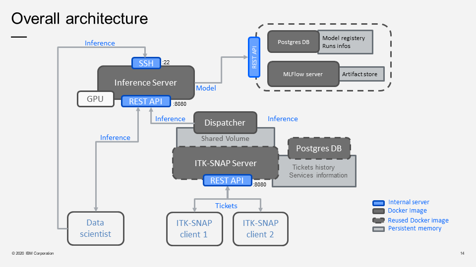

# ITK-SNAP Distributed Segmentation Service (DSS) Middleware Layer

This is the source code of the middleware layer for the IBM ITK-SNAP distributed segmentation service (DSS) adapted from the open source [ITK-SNAP DSS project](https://github.com/pyushkevich/alfabis_server). 


[ITK-SNAP](itksnap.org) is an interactive tool for segmentation of volumetric medical imaging datasets, like CT and MRI. 
DSS is a web-based application that allows data-scientists to make their advanced image processing algorithms available as services to ITK-SNAP users. 

### Global architecture



### Components details

**Web Server**

The web server as two main role in the Distributed Segmentation Service:
*  It's a web interface to visualize and manage available services, providers, ticket history and admin users. It also gives some informations about the different available services and about the DSS itself. The admin access is normally handled with OAuth2 but for testing purpose, a default user `test@example.com` have been created.
*  It's a RestAPI server that can receive tickets from ITK-Snap clients. It handles the different steps of the ticket processing logic and store them in a PosgresDB.

**Dispatcher**

The dispatcher is a set of deamons (one per service) that regularly check for new tickets on the server. When a ticket is available it is claimed by the corresponding deamon and the deamon handles all the steps required for ticket processing (data download, inference, workspace update, data upload).

**Services**

The services are the servers that perform the different tasks (for now `lung-segmantation` and `nodule-detection`). They have a RestAPI server that can be reach by the dispacher.

## Getting started
 
### Prerequisites

This project have been deployed on an [Open Shift](https://www.openshift.com) cluster running with `v3.11.161`


Each components of the architecture is fully Dockerised and require specific preriquisites:

*  Web Server
    *  No specific hardware requirement
    *  Persistent volume
    *  Expose port `8080` to an accessible route
*  DB
    *  No specific hardware requirement
*  Dispatcher
    *  No specific hardware requirement
    *  Persistent volume
*  Services:
    *  Power node (AC922) with a compatible GPU (see [docker image requirements](https://hub.docker.com/r/ibmcom/powerai) for more informations)
    *  Expose port `8080` to an accessible route


```
Give examples
```

### Installing

A step by step series of examples that tell you how to get a development env running

Say what the step will be

```
Give the example
```

And repeat

```
until finished
```

End with an example of getting some data out of the system or using it for a little demo

## Running the tests

Explain how to run the automated tests for this system

### Break down into end to end tests

Explain what these tests test and why

```
Give an example
```

### And coding style tests

Explain what these tests test and why

```
Give an example
```

## Deployment

Add additional notes about how to deploy this on a live system
