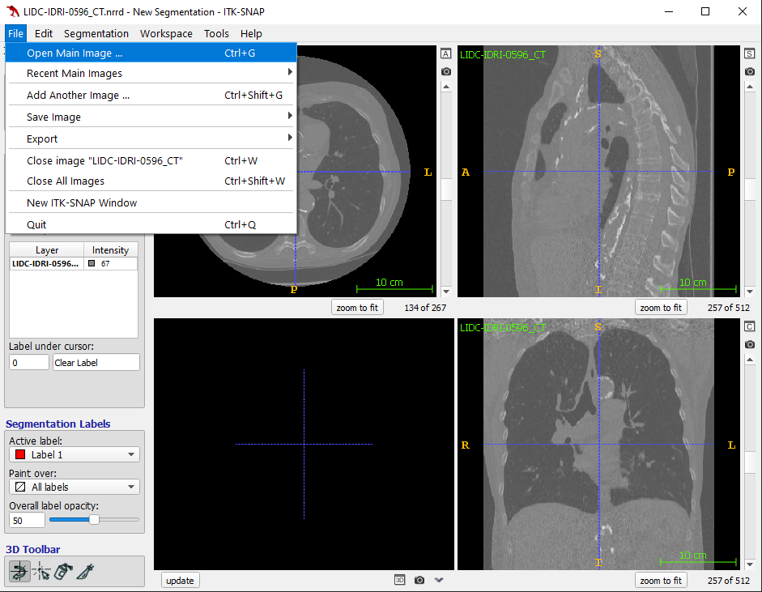
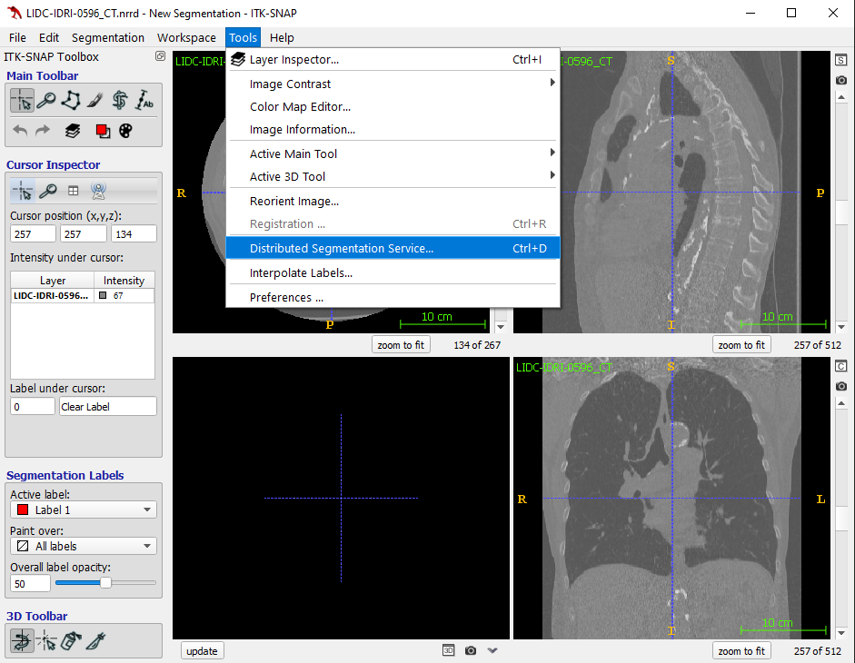
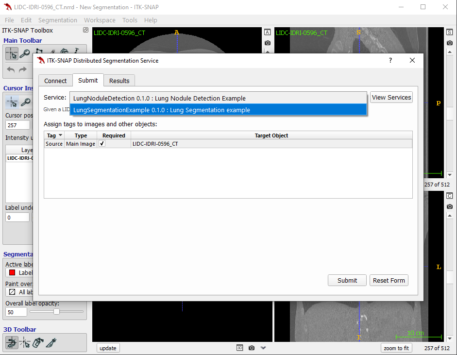
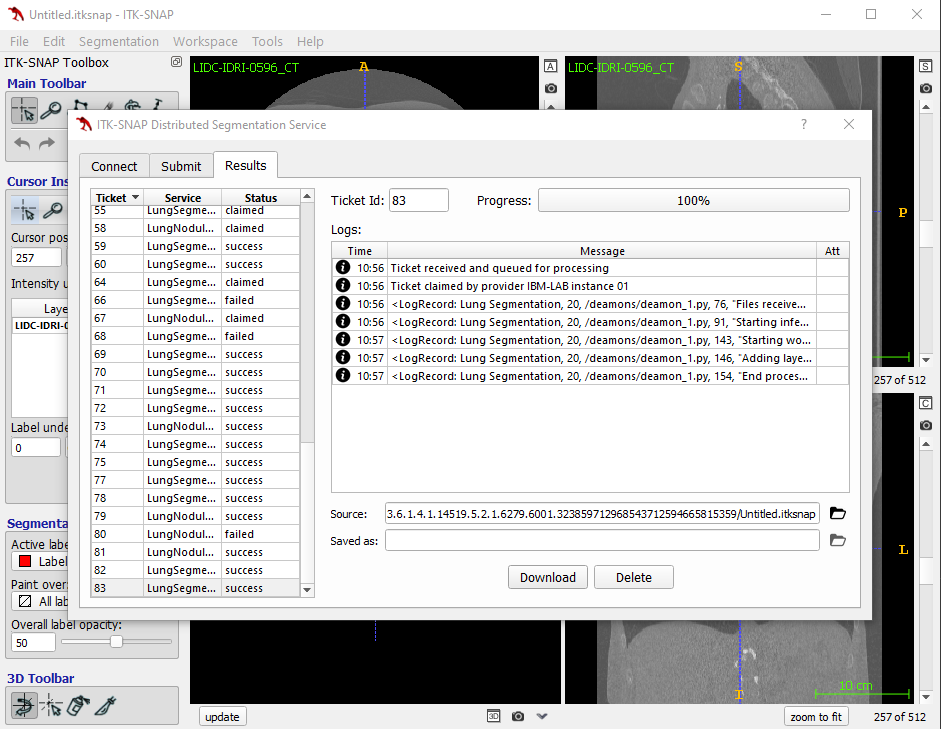
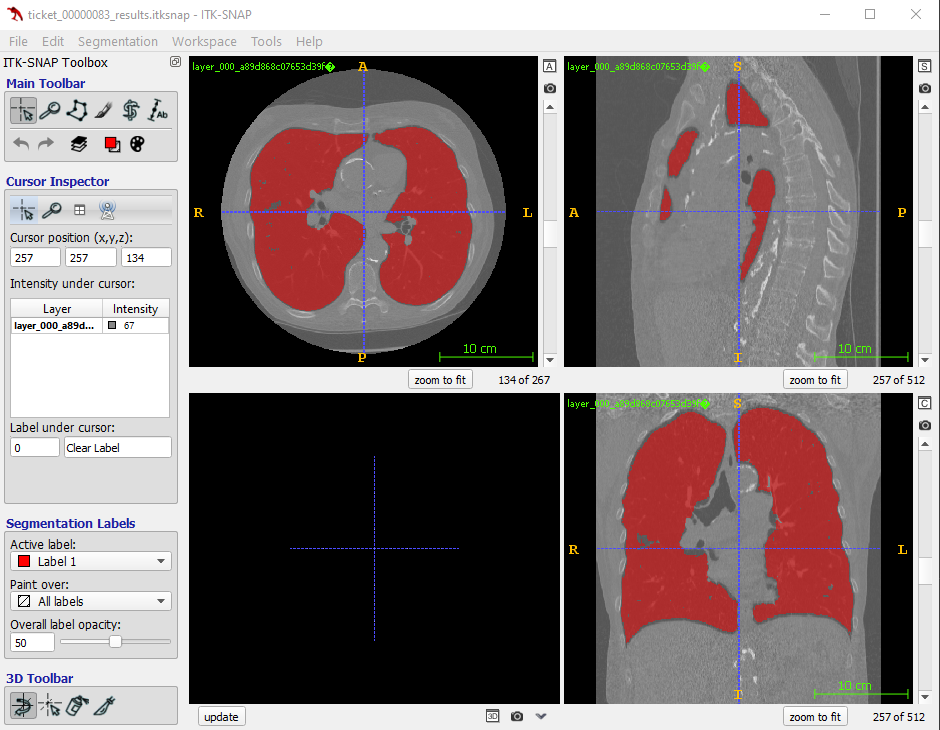

## Running DSS from ITK-SNAP

1. After running ITK-snap (version `>=3.8.0`), open an image by clicking `File > Open Main Image ...`. 
1. Open the Distributed Segmentation Service window by clicking `Tools > Distributed Segmentation Service...`. 
1. Connect to your ITK-SNAP DSS Server: 
    1. Click `Manage...` and type your server URL.
    1. Click `Get Token`, then type the access token in the `Login Token` input field.
1. Submit your image for processing: 
    1. GO to the `Submit` tab.
    1. Choose the segmentation service you want to use in the `Service` list.
    1. Click `Submit`, then chose where you want to save the ITK-snap workspace to upload.
1. Get updates on segmentation progress in real time 
1. Download results as ITK-SNAP workspace by clicking `Download` when processing is finished. 